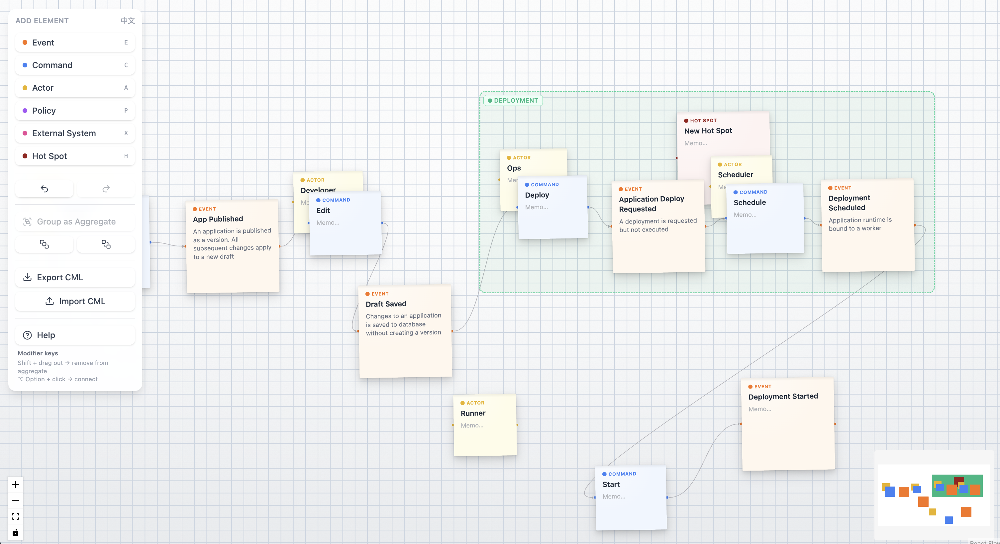

# Esbuddy

Esbuddy is a front-end app for visualising Event Storming workshops in Domain-Driven Design (DDD).



## Get started

Spin up the full stack (backend + SPA) locally, then open http://localhost:8787:

```bash
docker compose --env-file apps/server/.env.example up --build
```

## Elements

| Element | Color | Description |
|---|---|---|
| **Event** | orange `#f97316` | A significant thing that happened in the domain |
| **Command** | blue `#3b82f6` | An action that triggers an event |
| **Aggregate** | green `#10b981` | A boundary created by grouping Events/Commands; shown as a translucent box |
| **Actor** | yellow `#eab308` | A person or system that issues commands |
| **Policy** | purple `#a855f7` | Reactive logic triggered by an event ("when X, then Y") |
| **External System** | pink `#ec4899` | A dependency outside the system boundary |
| **Hot Spot** | red `#991b1b` | A conflict, question, or risk worth flagging |
| **Read Model** | green `#10b981` | The information an actor needs before making a decision |

## Notes & Aggregates

- Each element is a square sticky note with a **title** and optional **memo** (double-click to edit), resizable via corner handles, with adjustable z-order.
- Select 2+ Events/Commands and click **Group as Aggregate** to draw a boundary box. It always covers its children (drag a child out to grow it, or hold `Shift` to remove it), moves them along with it, and accepts free elements dropped onto it.
- **Invariants**: a child never leaves its aggregate · aggregates can't nest · an element belongs to at most one aggregate · empty aggregates are removed.

## Keyboard Shortcuts

| Shortcut | Action |
|---|---|
| `E` `C` `A` `P` `X` `H` `R` | Add an Event / Command / Actor / Policy / External System / Hot Spot / Read Model at the cursor |
| `Shift` + drag out | Remove a child from its aggregate |
| `⌥ Option` / `Alt` + click | Connect the selected node(s) to the clicked node |
| `[` / `]` | Send to back / bring to front |
| `⌘`/`Ctrl` + `Z`, `⌘`/`Ctrl` + `⇧Z` (or `Ctrl`+`Y`) | Undo / Redo |
| `⌘`/`Ctrl` + click | Multi-select |
| double-click | Edit a note's title or memo |

One concern per modifier: **Shift** removes from an aggregate · **⌥/Alt** connects nodes · **⌘/Ctrl** multi-selects.

## Canvas

Infinite canvas with zoom, pan, and MiniMap. Pan with two-finger scroll, middle/right drag, or `Space` + drag; box-select by dragging empty canvas; connect by dragging a handle or `⌥`-clicking. Nodes, edges, and viewport auto-save and restore on refresh.

## Import / Export

Export the canvas as Context Mapper (CML) — copy to clipboard or download `.cml`; import a `.cml` to render it. Supported: `Aggregate`, `Command`, `DomainEvent`, and `Flow` relations.

## Development

```bash
pnpm install
pnpm dev             # frontend only (:5173, LocalStore/localStorage)
pnpm dev:fullstack   # frontend (remote mode) + Hono server (:8787, SQLite)
pnpm build           # sdk → web → server (GitHub Pages artifact)
pnpm build:fullstack # fullstack / Docker artifact
pnpm typecheck       # typecheck all workspaces
pnpm lint            # oxlint
pnpm test            # server unit + integration (Node) + Cloudflare/D1 (Miniflare)
```

The frontend picks its storage via `VITE_STORE_MODE`: `local` (default) uses `localStorage`; `fullstack` mode talks to the backend `/api/*`. Backend config: copy `apps/server/.env.example` → `apps/server/.env` (dev mode, SSO off by default).

## Docker

```bash
docker compose up --build    # build image + start on http://localhost:8787
```

Multi-stage build (sdk → web → server); the runtime serves `apps/web/dist` + `/api/*` and persists SQLite in a named volume.

## Cloudflare (Workers + D1)

A single Worker serves both `/api/*` and the SPA (via the Assets binding), backed by D1 — sharing the platform-agnostic core with the Node path (`*.node.ts` / `*.worker.ts` provide the per-platform bootstrap). Config: `apps/server/wrangler.jsonc`.

```bash
cd apps/server

# One-time setup
pnpm exec wrangler d1 create esbuddy     # paste the printed database_id into wrangler.jsonc
pnpm db:migrate:d1                        # apply migrations (…:d1:local for local D1)
pnpm exec wrangler secret put JWT_SECRET  # + GOOGLE_CLIENT_ID / _SECRET / GOOGLE_REDIRECT_URI

# Deploy (from repo root)
pnpm deploy:cf

# Local dev against the Workers runtime (workerd + local D1)
pnpm build:cf && pnpm --filter @esbuddy/server db:migrate:d1:local && pnpm --filter @esbuddy/server cf:dev
```

## Roadmap

- [ ] Dark mode
- [ ] Right-click context menu to create elements
- [ ] Fuller CML support (Actor, Policy, External System mappings)
- [ ] Real-time multi-user collaboration (see `src/useHistory.ts` — the snapshot log is designed to be swapped for a serializable operation/command log)

## More on DDD

- [Aggregates: An In-depth Examination — DDD Europe](https://youtu.be/m7SMk8VA7Bg?si=O1PNsNpHIHV0LPVE)
- [A step by step guide to Event Storming](https://www.boldare.com/blog/event-storming-guide/)
- [Event Storming — The Storm That Cleans Up The Mess!](https://medium.com/@samar.benamar/event-storming-the-storm-that-cleans-up-the-mess-b2bb578db7c)
- [Context Mapper](https://contextmapper.org/)
